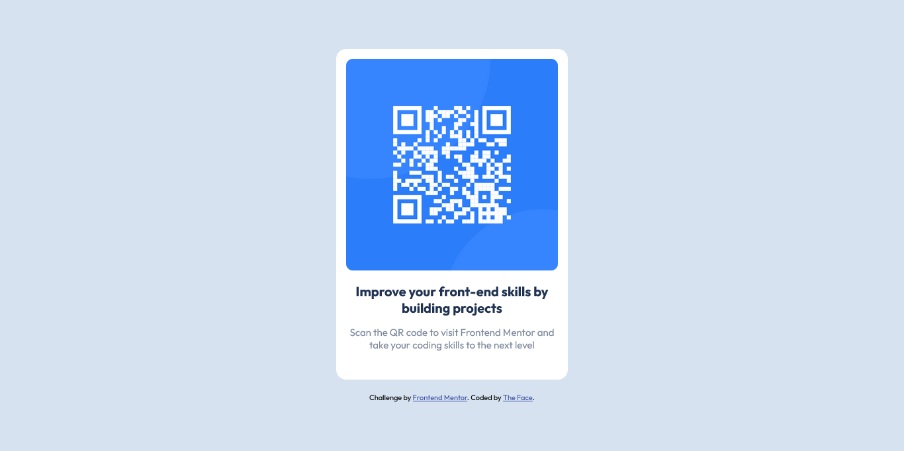

# Frontend Mentor - QR code component solution

This is a solution to the [QR code component challenge on Frontend Mentor](https://www.frontendmentor.io/challenges/qr-code-component-iux_sIO_H). Frontend Mentor challenges help you improve your coding skills by building realistic projects.

### Screenshot

### Links

- Solution URL: [Add solution URL here](https://www.frontendmentor.io/challenges/qr-code-component-iux_sIO_H/hub/qr-code-component--6261Mloe8)
- Live Site URL: [Add live site URL here](https://thefaceqr.netlify.app)

### Built with

- Semantic HTML5 markup
- CSS custom properties

## Author

- Website - [Ezekiel The Face](https://thefaceportfolio.netlify.app)
- Frontend Mentor - [@iamtheface](https://www.frontendmentor.io/profile/iamtheface)
- Twitter - [@thefacetweets](https://www.twitter.com/thefacetweets)
